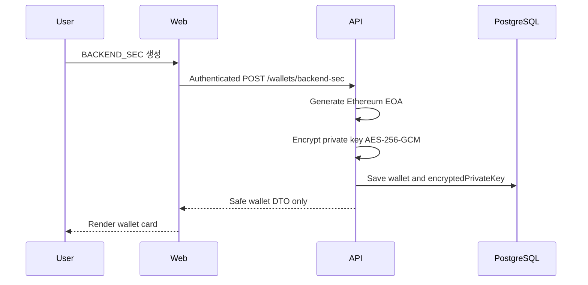
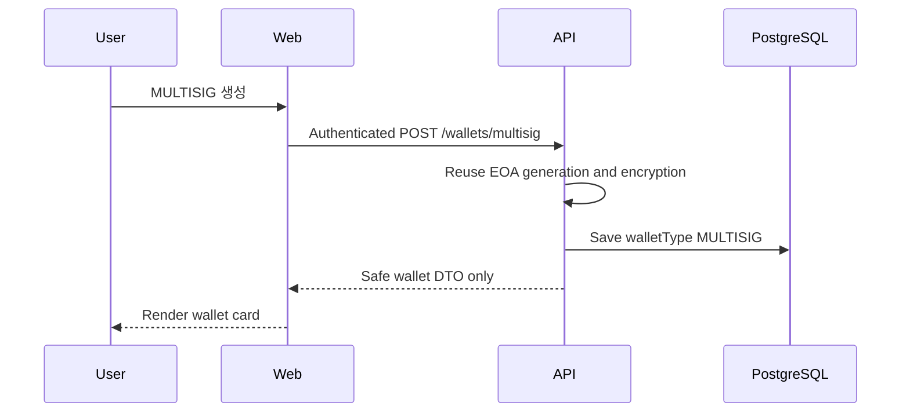
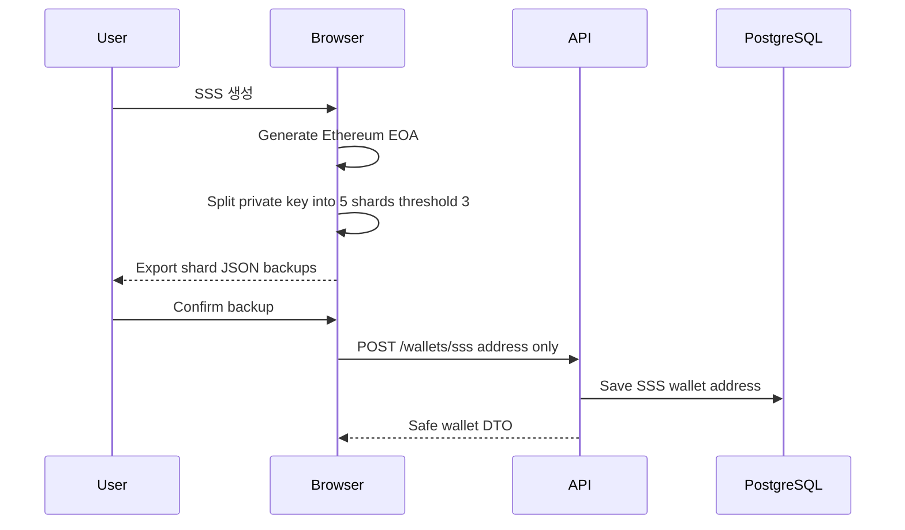
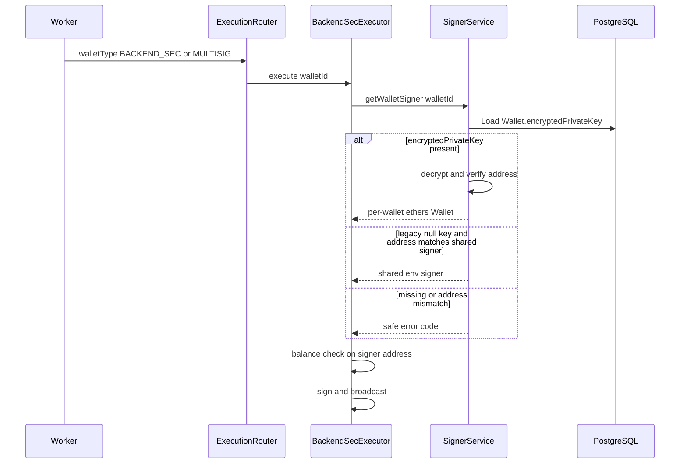

# Custody Security Wallet Demo

보안 중심 커스터디(Custody) 지갑 **포트폴리오 데모**입니다. 6가지 키 관리/보안 모델(BACKEND_SEC, MULTISIG, POLICY_GUARD, KMS, MPC(DFNS), SSS)을 **하나의 출금 파이프라인**(Policy → Queue → Worker → Executor → Audit → WebSocket) 위에서 비교·시연할 수 있도록 구현했습니다.

| 구분 | 상태 |
| --- | --- |
| **유저별 지갑 생성** | BACKEND_SEC / MULTISIG / SSS — 구현됨 |
| **공유·외부 연동 데모** | POLICY_GUARD / KMS / MPC — 사전 구성·외부 리소스 |
| **범위** | Sepolia 테스트넷 · 포트폴리오/데모 (프로덕션 커스터디 아님) |

아키텍처·보안 모델별 출금 흐름·Queue/Worker 파이프라인 등 **로직 상세**는 [`apps/api/README.md`](apps/api/README.md)를 참고하세요.

---

## 이 데모가 보여 주는 것

| 영역 | 내용 |
| --- | --- |
| 유저별 프로비저닝 | BACKEND_SEC·MULTISIG(서버 EOA+암호화 저장·**출금 시 per-wallet 서명**), SSS(브라우저 3-of-5 샤드) |
| 출금 처리 | Queue + Worker 비동기, Retry, Audit Log |
| 승인 | MULTISIG **DB 승인형** 앱 레벨 2-of-2 관리자 승인 + 10분 만료 |
| 인증 | httpOnly cookie JWT, verify-email URL(SMTP 없음), 0.01 ETH+ OTP |
| 키 관리 | Backend Signer / KMS / MPC / SSS / Policy Guard / Multisig |
| 실시간 | WebSocket `withdraw.updated` → API 재조회 |
| SSS | 브라우저에서 EOA·샤드·서명, 서버는 **주소 등록** 및 **signedTx**만 |

**Sepolia 테스트넷 전용**입니다. 실제 자산·메인넷 용도가 아닙니다.

---

## Implemented Wallet Provisioning

| Wallet type | 유저별 생성 | 키 위치 | 출금 모델 | 상태 |
| --- | --- | --- | --- | --- |
| BACKEND_SEC | Yes (`POST /wallets/backend-sec`) | DB `encryptedPrivateKey` (AES-256-GCM) | Queue → Worker → BackendSecExecutor → **per-wallet decrypt 서명** | 생성·출금 구현 |
| MULTISIG | Yes (`POST /wallets/multisig`) | DB `encryptedPrivateKey` (동일 유틸) | DB AdminApproval 2-of-2 → Queue → **per-wallet decrypt 서명** | 생성·출금 구현 · **온체인 멀티시그 아님** |
| SSS | Yes (`POST /wallets/sss` 주소만) | 브라우저 샤드만 (서버 키 없음) | 브라우저 signedTx → Queue → SssExecutor broadcast | 생성·복원·서명 구현 |
| POLICY_GUARD | No (UI placeholder만) | 공유 배포 PolicyVault | 컨트랙트 `withdraw()` | 유저별 프로비저닝 **계획** |
| KMS | No (UI placeholder만) | 공유 `AWS_KMS_KEY_ID` | KMS Sign | 외부 연동 데모 · **유저별 KMS 키 생성 비계획** |
| MPC | No (UI placeholder만) | 공유 `DFNS_WALLET_ID` | DFNS Transfer + Settlement polling | 외부 연동 데모 · **유저별 DFNS 지갑 생성 비계획** |

`@@unique([userId, walletType])` — 유저당 타입별 지갑 1개.

### 현재 프로비저닝 범위

**지금 구현됨**

- BACKEND_SEC 유저별 생성 + 출금 시 `encryptedPrivateKey` decrypt 서명
- MULTISIG 유저별 생성 + DB 승인 후 **동일** per-wallet 서명
- SSS 유저별 브라우저 생성·3-of-5 백업·복원·브라우저 서명

**계획**

- POLICY_GUARD 유저별 프로비저닝

**현재 포트폴리오 단계에서 의도적으로 하지 않음**

- 유저별 AWS KMS 키 프로비저닝
- 유저별 DFNS 지갑 프로비저닝

이유: KMS·DFNS는 **외부 서명/커스터디 연동**을 시연하며, 외부 리소스 수명주기는 이 애플리케이션 범위 밖입니다. 로컬 `Wallet` 행 삭제가 AWS/DFNS 리소스를 지우지 않습니다.

---

## Wallet Creation Flows

### BACKEND_SEC



### MULTISIG



### SSS



---

## Withdrawal Architecture (타입별)

공통: Policy 검사 → (타입별) Queue 등록 → Worker → ExecutionRouter → Executor → Audit → WebSocket.

| 타입 | 흐름 |
| --- | --- |
| BACKEND_SEC | User → API → Queue → Worker → BackendSecExecutor → **Wallet.encryptedPrivateKey** decrypt 서명 |
| MULTISIG | User → WithdrawRequest(PENDING) → AdminApproval 2-of-2 → Queue → Worker → BackendSecExecutor → **동일 per-wallet** 서명 |
| SSS | 샤드 3개로 브라우저 복원 → 로컬 signedTx → API 검증(signer/to/value/chainId/nonce) → Queue → SssExecutor broadcast |
| POLICY_GUARD | Queue → PolicyGuardExecutor → 공유 `POLICY_VAULT_ADDRESS` |
| KMS | Queue → KmsExecutor → 공유 AWS KMS |
| MPC | Queue → MpcExecutor → 공유 DFNS + Settlement polling |

> **서명:** 유저 프로비저닝 BACKEND_SEC/MULTISIG는 출금 시 `Wallet.encryptedPrivateKey`를 decrypt → 파생 주소가 `Wallet.address`와 일치하는지 검증 → 해당 키로 서명·broadcast합니다.  
> `encryptedPrivateKey`가 없는 **레거시** 행만, 공유 Signer 주소가 `Wallet.address`와 **정확히 일치할 때** `BACKEND_SIGNER_PRIVATE_KEY`로 폴백합니다. 주소가 다르면 실행을 거부합니다 (`WALLET_ENCRYPTED_KEY_MISSING`).



---

## Security Boundaries

### 서버 관리 키 (BACKEND_SEC / MULTISIG 생성분)

- 커스터디형 데모: 서버가 EOA를 만들고 `WALLET_ENCRYPTION_KEY`로 AES-256-GCM 암호화 후 DB 저장
- BACKEND_SEC 및 MULTISIG는 `Wallet.encryptedPrivateKey`를 이용하여 **출금 시에만** 복호화하며, 평문 Private Key는 DB나 API Response에 저장되지 않는다.
- API 응답에 private key / 암호문 / IV 미포함
- 출금 서명: per-wallet decrypt + 주소 검증 (레거시 주소 일치 시에만 공유 Signer 폴백)
- 유저 생성 지갑 출금은 **해당 Wallet.address** 잔액 사용 (공유 Signer 잔액이 아님)

### 브라우저 관리 키 (SSS)

- non-custodial 경계: 서버는 **공개 주소만** 등록
- 샤드·프라이빗 키·니모닉은 서버/DB에 저장하지 않음
- 출금 시 브라우저는 **signedTx만** 전송
- Shamir 분할 자체는 암호화가 아님 · 샤드 백업 책임은 사용자
- JS 메모리 zeroization은 보장하지 않음

### 외부 리소스 (KMS / DFNS / PolicyVault)

- env로 참조하는 **공유 데모 리소스**
- 로컬 Wallet 행 삭제 ≠ 외부 키/지갑/컨트랙트 삭제

---

## Tech Stack

| 영역 | 스택 |
| --- | --- |
| Frontend | React 19, Vite, TypeScript, React Router, shamirs-secret-sharing (SSS) |
| Backend | NestJS 11, Prisma 6, PostgreSQL |
| Auth | JWT (httpOnly cookie), bcrypt, TOTP (speakeasy) |
| Blockchain | ethers v6, Sepolia Testnet |
| 외부 연동 | AWS KMS, DFNS (MPC) |
| Realtime | Socket.IO |
| Validation | class-validator / class-transformer |
| Test | Jest (API), Vitest (web SSS utils) |

---

## Monorepo 구조

```text
.
├── apps/
│   ├── api/     # NestJS + Prisma + Postgres 백엔드
│   └── web/     # React + Vite 프론트엔드
├── packages/    # workspace 예약 (현재 shared 패키지 미사용)
├── contracts/   # PolicyGuard 온체인 컨트랙트 (Solidity)
└── docs/        # SSS 데모 복구 가이드 등
```

---

## Quick Start (로컬)

### 1. 최소 기동 요구사항

서버 프로세스가 **부팅되려면** 아래가 모두 필요합니다.

- Node.js 20+
- PostgreSQL
- `DATABASE_URL`, `JWT_SECRET`, `APP_BASE_URL`, `FRONTEND_URL`
- `SEPOLIA_RPC_URL` + `BACKEND_SIGNER_PRIVATE_KEY` (`SignerService` — POLICY_GUARD / SSS broadcast / 레거시 폴백)
- `AWS_REGION` + `AWS_KMS_KEY_ID` (+ IAM) (`KmsService`)
- DFNS 관련 env + credential PEM (`MpcService`)
- **`WALLET_ENCRYPTION_KEY`** — BACKEND_SEC / MULTISIG 유저 생성·출금 decrypt에 필수 (64 hex = 32 bytes)

> API는 부팅 시 `SignerService`, `KmsService`, `MpcService`를 **항상 초기화**합니다.  
> Settings의 “연결 안 됨”은 **런타임 헬스체크** 결과이며, env 미설정과는 별개입니다.

### 2. 설치

```bash
git clone <repo-url>
cd custody-security-wallet-demo
npm install
```

### 3. 환경 변수

```bash
cp apps/api/.env.example apps/api/.env
cp apps/web/.env.example apps/web/.env
```

[`apps/api/.env.example`](apps/api/.env.example)의 **부팅 필수 항목**과 `WALLET_ENCRYPTION_KEY`를 채웁니다. 상세는 [`apps/api/README.md#environment-variables`](apps/api/README.md#environment-variables).

프론트:

| 변수 | 용도 |
| --- | --- |
| `VITE_API_URL` | API/WebSocket base (기본 `http://localhost:3000`) |
| `VITE_SEPOLIA_RPC_URL` | SSS 브라우저 서명용 Sepolia RPC (**SSS 시연에 필요**) |

### 4. DB 마이그레이션

```bash
npm --workspace apps/api exec prisma migrate dev
```

### 5. 데모 데이터 (호스팅 데모 vs 신규 clone)

**seed 스크립트는 의도적으로 포함하지 않습니다.**  
KMS / DFNS / 온체인 PolicyVault / 펀딩된 Sepolia 주소는 외부 프로비저닝이 필요해, DB만으로 “6종 전부 동작”을 재현하는 seed는 오해를 부릅니다.

| 구분 | 가능 범위 |
| --- | --- |
| **호스팅 데모** | 사전 provisioning된 PostgreSQL(테스트 계정 + 외부 연동 완료)을 가정. `test@test.com` 등 |
| **신규 clone** | 마이그레이션 후 회원가입 → Wallets에서 BACKEND_SEC / MULTISIG / SSS **셀프 생성** 가능 |
| **POLICY_GUARD / KMS / MPC** | 유저별 생성 API 없음 · 공유 데모는 사전 Wallet 행 + 외부 env 필요 |

외부 모델별 수동 준비(요약):

- BACKEND_SEC / MULTISIG **출금 실행**: 유저 생성분은 per-wallet 키 · 레거시(암호화 키 없음)는 주소 일치 시에만 공유 Signer
- POLICY_GUARD: 배포된 vault + `POLICY_VAULT_ADDRESS`
- KMS: AWS KMS 키 + IAM
- MPC: DFNS wallet + credential PEM
- SSS (레거시 공개 데모): [`docs/SSS_DEMO_RECOVERY.md`](docs/SSS_DEMO_RECOVERY.md) · 신규 SSS는 사용자가 생성한 샤드 백업 사용

### 6. 개발 서버

```bash
npm run dev:api   # http://localhost:3000 (PORT 있으면 그 값, 0.0.0.0 bind)
npm run dev:web   # http://localhost:5173
```

### 7. 테스트

```bash
npm --workspace apps/api run test       # 단위 테스트 (DB 불필요)
npm --workspace apps/api run test:e2e   # e2e (Postgres + .env 필요, CI 제외)
npm --workspace apps/web run test       # SSS 샤드 유틸 (Vitest)
```

---

## 필수 환경 변수

| 변수 | 용도 |
| --- | --- |
| `DATABASE_URL` | PostgreSQL |
| `JWT_SECRET` | JWT + 계정별 OTP secret 파생 |
| `APP_BASE_URL` | verify-email URL 생성용 (SMTP 없음; register 응답의 `verifyUrl`) |
| `FRONTEND_URL` | CORS + WebSocket origin |
| `SEPOLIA_RPC_URL` | Sepolia JSON-RPC |
| `BACKEND_SIGNER_PRIVATE_KEY` | POLICY_GUARD 실행 · SSS broadcast provider · 레거시 BACKEND_SEC/MULTISIG **주소 일치 폴백** · 헬스. **신규 유저 생성분 출금의 주 서명자가 아님** |
| `WALLET_ENCRYPTION_KEY` | 유저 BACKEND_SEC/MULTISIG PK 암·복호화 (64 hex). 생성 시 encrypt · 출금 시 decrypt. **분실 시 저장된 암호문 복호화 불가** |
| `POLICY_VAULT_ADDRESS` | POLICY_GUARD vault 컨트랙트 (출금 실행 시) |
| `AWS_REGION`, `AWS_KMS_KEY_ID` (+ IAM 자격) | KMS 지갑 (공유) |
| `DFNS_*`, `DFNS_PRIVATE_KEY_PEM` (또는 로컬 `DFNS_PRIVATE_KEY_PATH`) | MPC(DFNS) 지갑 (공유) |
| `PORT` | (선택) listen 포트. 미설정 시 3000 |

프론트: `VITE_API_URL`, `VITE_SEPOLIA_RPC_URL` (SSS 서명). SSS 서버 측 PK env는 **없음**.

---

## 인증·회원가입 (로직 요약)

```text
POST /auth/register → User(status=PENDING) + verify-email JWT
GET  /auth/verify-email?token=... → status=ACTIVE
POST /auth/login → httpOnly accessToken cookie (type=access)
GET  /auth/me → 세션 확인 (프론트 ProtectedRoute)
```

- 실제 이메일 발송 없음. register 응답의 `verifyUrl` / UI 인증 버튼으로만 ACTIVE 전환
- verify-email JWT는 **API 인증에 사용 불가** (`JwtStrategy`에서 차단)
- PENDING 사용자는 **10분 후 cron**으로 삭제 (미인증 가입 정리)
- 회원가입 비밀번호: **8자 이상** / 로그인 화면 테스트 계정은 **프로비저닝 DB 전제**의 데모용 짧은 비밀번호일 수 있음
- 회원가입만으로 지갑이 **자동 생성되지는 않음** — Wallets UI에서 BACKEND_SEC / MULTISIG / SSS를 생성

---

## SSS (유저별 생성 + 레거시 데모)

### 유저별 SSS (구현됨)

1. 브라우저에서 EOA 생성 → 프라이빗 키를 **3-of-5** Shamir 샤드로 분할
2. 샤드 JSON을 **개별 파일로 백업** (서버·localStorage 자동 저장 없음)
3. 백업 확인 후 `POST /wallets/sss`에 **공개 주소만** 등록
4. 출금: 샤드 ≥3개로 로컬 복원 → Sepolia signedTx → 서버 검증·Queue → Worker broadcast

**private key / shards는 서버로 전송되지 않습니다.** 출금 성공 후 프론트 복원 세션은 비웁니다.

제한: 샤드 3개 이상 분실 시 서비스도 복구 불가 · 3개 이상 동시 보관은 분리 모델 약화 · Shamir ≠ 암호화.

### 레거시 공개 데모 지갑

포트폴리오 시연용 **고정 데모 지갑**의 공개 3/5 샤드: [`docs/SSS_DEMO_RECOVERY.md`](docs/SSS_DEMO_RECOVERY.md) · 오프라인 도구 [`apps/api/tools/offline-sss-recovery/`](apps/api/tools/offline-sss-recovery/).  
UI에서 레거시 hex 샤드 import도 지원합니다. 복구된 키는 문서에 적지 마세요.

---

## Known Limitations

- Sepolia 테스트넷 전용 · 포트폴리오/데모 (프로덕션 커스터디 아님)
- MULTISIG는 **DB 승인형 워크플로우**이지 온체인 M-of-N / Safe가 아님
- BACKEND_SEC/MULTISIG 유저 생성분은 per-wallet 암호화 키로 서명 · 공유 Signer는 레거시 주소 일치 폴백만
- 유저 생성 BACKEND_SEC/MULTISIG 출금 전 **해당 지갑 주소**에 Sepolia ETH가 있어야 함 (공유 Signer 잔액으로 대신 보내지 않음)
- POLICY_GUARD 유저별 프로비저닝 미구현 (UI 안내만)
- AWS KMS / DFNS는 **사전 구성된 공유** 외부 리소스 · 유저별 프로비저닝 비계획
- SSS 샤드 백업은 사용자 책임 · 3/5 이상 분실 시 복구 불가
- Shamir 샤드는 자동 암호화되지 않음 · 브라우저 메모리 zeroization 미보장
- 공유 외부 데모 리소스에 실자산을 두지 말 것
- seed 없음 · KMS/DFNS/PolicyVault는 외부 준비 필요

---

## 배포 (포트폴리오 / 데모 호스팅)

| 구분 | 설정 |
| --- | --- |
| API | Railway · `NODE_ENV=production`, `FRONTEND_URL=https://<프론트-도메인>`, `APP_BASE_URL=https://<API-도메인>`, `PORT`는 호스트 주입값 사용 |
| Web | Vercel · 빌드 시 `VITE_API_URL=https://<API-도메인>`, SSS면 `VITE_SEPOLIA_RPC_URL` |
| DB | Railway PostgreSQL · `prisma migrate deploy` + (선택) pre-provisioned 데모 데이터 |
| Cookie | production: `httpOnly` + `secure: true` + `sameSite: 'none'` (크로스 사이트 front/API + HTTPS 전제) |
| CORS / WS | `FRONTEND_URL` 단일 origin + `credentials: true` (`*` 사용 안 함) |

### Railway (API) — 대시보드 권장값

모노레포 **루트**를 서비스 Root Directory로 둡니다. (`railway.json` / Dockerfile 불필요)

| 항목 | 값 |
| --- | --- |
| Root Directory | `/` (repository root, 비움) |
| Install Command | `npm ci` |
| Build Command | `npx prisma generate --schema apps/api/prisma/schema.prisma && npm run build --workspace apps/api` |
| Start Command | `npm run start:prod --workspace apps/api` |
| Pre-Deploy / Release | `npx prisma migrate deploy --schema apps/api/prisma/schema.prisma` |
| Health Check Path | 비움 (공개 unauthenticated health 엔드포인트 없음 · `/system/health`는 Admin JWT 필요) |

- `listen(PORT, '0.0.0.0')` 이미 적용됨. Railway가 주입하는 `PORT` / `DATABASE_URL` 사용.
- DFNS credential 키: Railway Variables에 **`DFNS_PRIVATE_KEY_PEM`** (PEM 본문)을 넣으세요. escaped `\n` 지원. 파일/Volume 불필요. 실키는 커밋하지 마세요.
- 로컬 개발 폴백: `DFNS_PRIVATE_KEY_PATH` (PEM 파일 경로). `DFNS_PRIVATE_KEY_PEM`이 있으면 파일을 읽지 않습니다.

### Vercel (Web) — 대시보드 권장값

| 항목 | 값 |
| --- | --- |
| Root Directory | `apps/web` |
| Framework Preset | Vite |
| Install Command | `cd ../.. && npm ci` |
| Build Command | `cd ../.. && npm run build --workspace apps/web` |
| Output Directory | `dist` |
| SPA fallback | `apps/web/vercel.json` (`/(.*) → /index.html`) |

환경 변수(빌드 타임): `VITE_API_URL`, `VITE_SEPOLIA_RPC_URL`. WebSocket도 동일 `VITE_API_URL`을 사용합니다.

로컬 예:

```env
FRONTEND_URL=http://localhost:5173
```

프로덕션 예:

```env
FRONTEND_URL=https://your-frontend-domain.example
```

프론트·API를 **서로 다른 site**에 두고 cookie 인증을 쓰려면 위 production cookie 설정과 HTTPS가 필요합니다.  
동일 origin 리버스 프록시를 쓰면 배포가 더 단순합니다.

**빈 DB clone**에서도 BACKEND_SEC / MULTISIG / SSS 셀프 생성은 가능합니다. POLICY_GUARD·KMS·MPC 공유 시연은 provisioning된 DB + 외부 연동이 필요합니다.

---

## Root scripts

| 명령어 | 설명 |
| --- | --- |
| `npm run dev:api` | 백엔드 개발 서버 (watch) |
| `npm run dev:web` | 프론트엔드 개발 서버 |
| `npm run build:api` | 백엔드 프로덕션 빌드 |
| `npm run build:web` | 프론트엔드 프로덕션 빌드 |

---

## CI

[`.github/workflows/ci.yml`](.github/workflows/ci.yml) — PR/Push 시 API/Web lint(경고만), unit test, build.  
DB e2e는 CI 제외 → 로컬 `npm run test:e2e`.

---

## 배포 전 체크리스트

- [ ] `.env` 부팅 필수 변수 + `WALLET_ENCRYPTION_KEY` + DFNS (`DFNS_PRIVATE_KEY_PEM` 또는 로컬 `DFNS_PRIVATE_KEY_PATH`)
- [ ] `FRONTEND_URL` / `VITE_API_URL` / (SSS) `VITE_SEPOLIA_RPC_URL` 배포 값
- [ ] `NODE_ENV=production` + HTTPS (cookie `secure` + `sameSite=none`)
- [ ] (선택) provisioning된 DB (공유 POLICY_GUARD/KMS/MPC + 테스트 계정) 또는 호스팅 dump
- [ ] Sepolia 테스트넷 전용 · SSS 공개 샤드는 **레거시 데모 의도** · 신규 SSS는 사용자 백업

리뷰어가 clone만으로 전체 6종 시연하려면 **외부 연동(KMS/DFNS/Vault) + (선택) DB provisioning**이 핵심입니다. BACKEND_SEC/MULTISIG/SSS는 UI에서 생성할 수 있습니다.
