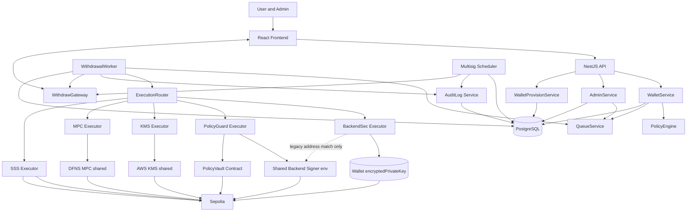
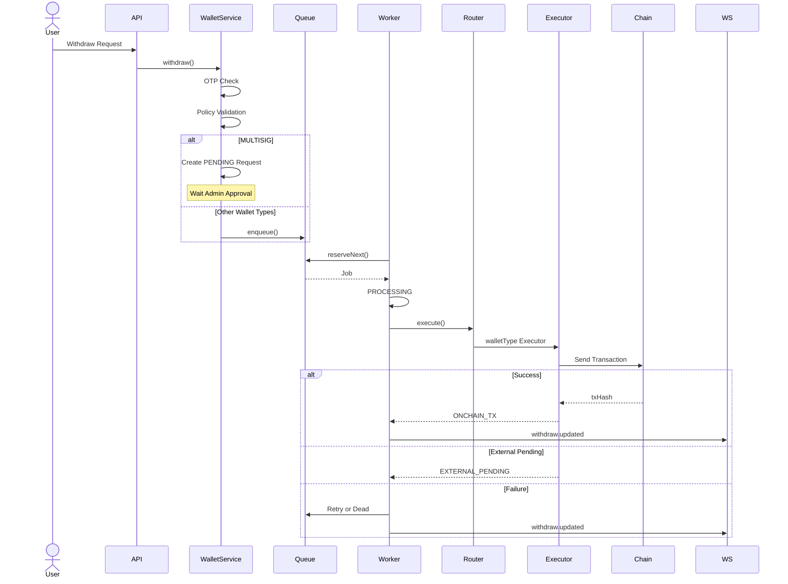
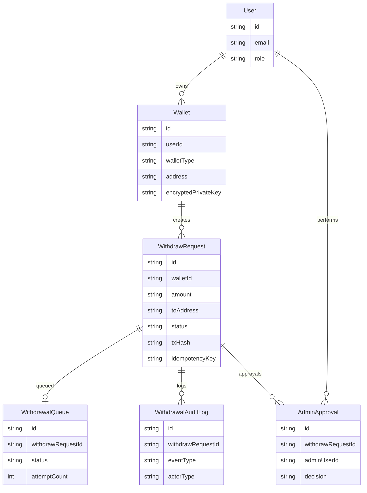

# Custody Security Wallet Demo — API

보안 중심 커스터디 지갑 **포트폴리오 데모**의 NestJS 백엔드입니다.

다양한 키 관리 모델(Backend Signer, Multisig, Policy Guard, AWS KMS, MPC, SSS)을 **동일한 출금 파이프라인**(Policy → Queue → Worker → Executor → Audit → WebSocket) 위에서 비교할 수 있도록 설계했습니다.

> **유저별 지갑 생성(구현됨):** `POST /wallets/backend-sec`, `POST /wallets/multisig`, `POST /wallets/sss`(주소만), `POST /wallets/policy-guard`.  
> **공유·외부 데모:** KMS / MPC는 사전 Wallet 행 + env 외부 리소스. POLICY_GUARD는 유저별 생성 가능하며, 호스팅 데모의 사전 Wallet 행도 그대로 사용합니다.  
> 회원가입만으로 지갑이 **자동** 생성되지는 않습니다 — 프론트 Wallets UI에서 생성합니다.  
> 포트폴리오 개요는 [`../../README.md`](../../README.md)를 참고하세요.

---

# Overview

Custody Security Wallet Demo는 단순 지갑 CRUD 프로젝트가 아닌, 실제 금융 및 커스터디 서비스에서 사용되는 출금 처리 워크플로우를 학습하고 구현하기 위한 프로젝트입니다.

출금 요청은 즉시 실행되지 않고 Queue 기반 비동기 파이프라인을 통해 처리되며, Worker, Scheduler, WebSocket, Audit Log를 활용하여 안정성과 추적성을 확보했습니다.

## 핵심 목표

* 다양한 Wallet Security Model 비교
* Queue 기반 비동기 출금 처리
* 실시간 상태 동기화
* Audit Trail 구축
* 출금 정책 및 승인 프로세스 구현
* 외부 키 관리 시스템(KMS / MPC) 연동

---

# Architecture

## System Architecture



**키 경계 요약**

| 구분 | 타입 | 비고 |
| --- | --- | --- |
| 서버 생성·암호화 저장 | BACKEND_SEC, MULTISIG | `encryptedPrivateKey` · 출금 시 per-wallet decrypt 서명 (레거시는 주소 일치 폴백) |
| 브라우저 키 | SSS | 서버는 주소 + signedTx만 |
| 유저별 PolicyVault | POLICY_GUARD | `POST /wallets/policy-guard` · 출금은 `Wallet.address` + 공유 Signer |
| 공유 외부 | KMS, MPC | AWS / DFNS env |

사용자는 React 프론트엔드를 통해 출금 요청을 생성합니다.

출금 요청은 Queue에 등록되고 Worker가 비동기로 처리됩니다.
ExecutionRouter는 walletType에 따라 적절한 Executor를 선택하며,
실행 결과는 AuditLog에 기록되고 WebSocket 이벤트를 통해 실시간으로 프론트에 반영됩니다.

이를 통해 출금 요청 생성과 실제 송금 실행을 분리하여 안정성과 확장성을 확보했습니다.
또한 WalletType별 Executor 분리를 통해 새로운 지갑 타입을 최소한의 수정으로 확장할 수 있도록 설계했습니다.

---

## Withdrawal Processing Flow



출금 요청은 Queue 기반 비동기 구조로 처리됩니다. MULTISIG는 관리자 승인 이후 Queue에 등록되며, 나머지 지갑 타입은 즉시 Queue에 등록됩니다. Worker는 Queue를 polling하며 `FOR UPDATE SKIP LOCKED`로 작업을 원자적으로 예약해 다중 Worker/인스턴스 환경에서도 중복 처리를 방지합니다. ExecutionRouter를 통해 walletType별 Executor를 선택하고, 결과를 WebSocket으로 전달합니다.

---

## Database ERD



핵심 출금 도메인은 User → Wallet → WithdrawRequest 구조를 중심으로 설계했습니다. WithdrawRequest는 Queue를 통해 비동기 처리되며, 모든 상태 변경은 AuditLog에 기록됩니다. MULTISIG 지갑은 AdminApproval을 통해 승인 이력을 관리합니다.


# Tech Stack

## Frontend

* React
* Vite
* TypeScript
* Axios
* Socket.IO Client

## Backend

* NestJS
* TypeScript
* Prisma
* PostgreSQL
* JWT
* bcrypt
* Scheduler
* WebSocket
* Queue / Worker

## Blockchain

* ethers v6
* Solidity
* Hardhat
* Sepolia

---

# 주요 기능

## 1. 6가지 보안 지갑 모델

지원 지갑 타입

* BACKEND_SEC
* MULTISIG
* POLICY_GUARD
* KMS
* MPC
* SSS

각 지갑은 서로 다른 보안 모델과 출금 흐름을 가집니다.

> **유저별 생성 API:** `POST /wallets/backend-sec`, `POST /wallets/multisig`, `POST /wallets/sss`(공개 주소만), `POST /wallets/policy-guard`.  
> KMS / MPC는 유저별 생성 API가 없으며, 공유 데모용 Wallet 행 + 외부 env를 사용합니다.  
> `test@test.com` 등 호스팅 데모 계정은 사전 provisioning된 6종 지갑을 가질 수 있습니다.

### BACKEND_SEC

화이트리스트 기반 출금 제어 지갑입니다. 유저별 생성 시 서버가 EOA를 만들고 `encryptedPrivateKey`를 AES-256-GCM으로 저장합니다.

BACKEND_SEC 및 MULTISIG는 `Wallet.encryptedPrivateKey`를 이용하여 **출금 시에만** 복호화하며, 평문 Private Key는 DB나 API Response에 저장되지 않는다.

Policy Engine이 출금 정책을 검증합니다.  
**whitelist에 주소가 1개 이상일 때만** `toAddress`를 제한합니다. whitelist가 **비어 있으면** 주소 제한은 적용되지 않습니다(self-transfer·한도 검사는 그대로).

출금 실행은 Queue → Worker → BackendSecExecutor → `SignerService.getWalletSigner(walletId)` → `Wallet.encryptedPrivateKey` decrypt 서명입니다. decrypt 후 파생 주소가 `Wallet.address`와 일치해야 하며, 불일치 시 broadcast 없이 `WALLET_SIGNER_ADDRESS_MISMATCH`로 실패합니다. `encryptedPrivateKey`가 없는 레거시 행만 공유 Signer 주소가 Wallet.address와 일치할 때 `BACKEND_SIGNER_PRIVATE_KEY`로 폴백합니다.

### MULTISIG

**DB 승인형 멀티시그 워크플로우**입니다. **온체인 멀티시그 컨트랙트가 아니라**, 백엔드에서 AdminApproval로 승인 이력을 관리한 뒤 BACKEND_SEC와 동일한 **per-wallet** 서명 경로로 트랜잭션을 실행합니다.

유저별 생성은 BACKEND_SEC와 동일하게 EOA 생성·암호화 저장(`walletType=MULTISIG`)합니다.

사용자가 출금 요청을 생성하면 PENDING 상태가 되며, 관리자 2명이 승인하면 Queue에 등록됩니다.

10분 내 승인이 완료되지 않으면 자동 만료됩니다.

### POLICY_GUARD

온체인 PolicyVault + PolicyGuard로 출금 한도를 강제하는 지갑입니다.  
`POST /wallets/policy-guard`로 유저별 PolicyVault를 배포하고 `Wallet.address`에 저장합니다. PolicyGuard는 env `POLICY_GUARD_ADDRESS`를 공유합니다.  
호스팅 데모의 사전 Wallet 행(기존 공유 vault)도 그대로 두며, 출금은 항상 `Wallet.address`의 `withdraw()`를 호출합니다.

### KMS

AWS KMS 기반 **공유** 외부 키 관리 연동 데모입니다. 유저별 KMS 키 생성은 **현재 포트폴리오 단계에서 계획하지 않습니다.**

KMS 서명을 통해 트랜잭션을 생성하고 브로드캐스트합니다. 동시 nonce 충돌을 막기 위해 PostgreSQL advisory lock(`pg_try_advisory_lock`)으로 KMS 전송 구간을 직렬화합니다.

### MPC

MPC 지갑은 외부 분산 서명 제공자(DFNS)와 연동하는 **공유** 데모입니다. 유저별 DFNS 지갑 생성은 **현재 포트폴리오 단계에서 계획하지 않습니다.**

* MpcService
* MpcExecutor
* ExecutionRouter

를 분리하여 다른 지갑 타입과 독립적으로 출금 흐름을 관리합니다.

MpcSettlementService는 DFNS transfer 상태를 주기적으로 조회하여 Confirmed 상태이면 WithdrawRequest를 EXECUTED로, Failed / Rejected / Cancelled 상태이면 FAILED로 동기화합니다.

현재 데모에서는 DFNS를 MPC Provider로 사용합니다.

### SSS

Shamir's Secret Sharing 기반 **유저별 브라우저 프로비저닝** 지갑입니다.

* 브라우저 EOA 생성 + 3-of-5 Secret Sharing (`shamirs-secret-sharing`)
* `POST /wallets/sss` — **공개 주소만** 등록 (`encryptedPrivateKey` 없음)
* Client-side Transaction Signing
* Backend Signed Transaction Validation (signer, to, value, chainId, nonce)
* Signed Transaction Broadcast via Worker (`SssExecutor`)

복구된 private key·샤드는 브라우저에서만 사용되며, API 요청 본문이나 DB에는 절대 전송·저장되지 않습니다.

서버 측 SSS unlock / “1회 후 자동 잠금” 상태는 없습니다. 흐름은 “브라우저 샤드 복원 → signedTx 검증 → broadcast”이며, 요청 성공 후 프론트가 복원 세션을 비웁니다. (과거 `WalletSecurityState` / `SssUnlockState` 스키마는 제거됨)

서버는 브라우저에서 서명이 완료된 `signedTx`만 수신합니다. `signedTx`는 signer, recipient, amount, chainId, nonce를 검증하는 데 사용되고, 이후 Worker가 브로드캐스트할 수 있도록 `WithdrawRequest.metadata.sssSignedTx`에 저장된 후 Queue에 등록됩니다. 브로드캐스트 성공 후 metadata에서 `sssSignedTx`는 삭제됩니다.

> 참고: `signedTx`는 (private key와 달리) 이미 서명이 끝난 트랜잭션이므로 저장해도 개인키가 노출되지는 않지만, 서명된 트랜잭션 원문이 남기 때문에 실제 운영 환경에서는 브로드캐스트 완료 후 폐기하거나 암호화 저장하는 것을 권장합니다.

#### Sepolia 데모 (공개 샤드)

포트폴리오·시연용으로 **3/5 샤드를 문서에 공개**합니다. 운영 환경에서는 custodian 분산 보관이 필수입니다.

* 가이드: [`docs/SSS_DEMO_RECOVERY.md`](../../docs/SSS_DEMO_RECOVERY.md)
* 오프라인 복구: [`tools/offline-sss-recovery/`](tools/offline-sss-recovery/) — `npm run recover` (로컬 검증용). 웹 UI 출금은 **샤드 복원 모달**에 문서의 레거시 hex 샤드 3개를 import합니다.

---

# Queue / Worker 기반 출금 처리

출금 요청은 즉시 실행되지 않고 Queue를 통해 비동기 처리됩니다.

```text
WithdrawRequest 생성
→ WithdrawalQueue 등록
→ Worker Polling
→ ExecutionRouter
→ WalletType Executor
→ 상태 업데이트
→ AuditLog 기록
```

## Worker Processing Model

Worker는 5초마다 Queue를 Polling합니다. 작업 예약은 `UPDATE ... FOR UPDATE SKIP LOCKED`로 원자적으로 수행되어, 여러 Worker 프로세스가 동시에 실행되어도 동일 job을 중복 처리하지 않습니다.

정상 처리 흐름

```text
PENDING
→ RESERVED
→ RUNNING
→ SUCCEEDED
```

해당 상태는 WithdrawalQueue 기준 상태이며,
WithdrawRequest 상태는 QUEUED → PROCESSING → EXECUTED 또는 FAILED 로 관리됩니다.

실패 처리 흐름

```text
RUNNING
→ RETRY_WAIT
→ DEAD
```

재시도는 최대 3회 수행됩니다.

---

# MULTISIG 자동 만료 Scheduler

MULTISIG 출금 요청은 10분 내 승인되지 않으면 자동 만료됩니다.

Scheduler는 1분마다 다음 조건을 확인합니다.

```text
status = PENDING
expiresAt < now
```

조건을 만족하면:

```text
status = EXPIRED
failureReason = "Multisig approval expired"
finalizedAt = now
```

로 변경됩니다.

---

# WebSocket 기반 실시간 상태 반영

출금 상태가 변경되면 WebSocket 이벤트를 프론트로 전송합니다.

이벤트 이름

```text
withdraw.updated
```

프론트는 이벤트 수신 시 상태를 직접 수정하지 않고 기존 API를 재조회합니다.

```text
withdraw.updated 수신
→ 출금 이력 API 재조회
→ UI 갱신
```

이를 통해 상태 불일치를 줄이고 API를 Single Source of Truth로 유지했습니다.

---

# Idempotency-Key 기반 중복 출금 방지

출금 API는 Idempotency-Key 헤더를 사용합니다.

```text
첫 요청
→ WithdrawRequest 생성
→ idempotencyKey 저장

동일 키 재요청
→ 기존 요청 반환
→ Queue 재생성 방지
→ 중복 송금 방지
```

---

# Risk-Based OTP 인증

0.01 ETH 이상 출금 시 Google Authenticator 기반 OTP 인증을 요구합니다. OTP secret은 계정(`userId`)마다 `JWT_SECRET`에서 파생되며, `GET /auth/totp-setup`으로 확인할 수 있습니다.

```text
0.01 ETH 미만
→ OTP 불필요

0.01 ETH 이상
→ 계정별 OTP 필수
```

OTP 검증 실패 시 출금 요청은 생성되지 않습니다.

---

# 프론트 중복 클릭 방지

UX 차원의 중복 요청 방지를 위해 출금 버튼 클릭 후 3초 동안 재클릭을 차단합니다.

```text
출금 버튼 클릭
→ 버튼 비활성화
→ 3초 차단
```

백엔드 Idempotency-Key와 함께 적용하여 중복 요청을 최소화했습니다.

---

# Audit Log

출금 처리 과정의 주요 이벤트를 DB에 기록합니다.

예시 이벤트

* REQUEST_CREATED
* QUEUED
* EXECUTION_STARTED
* TX_CONFIRMED
* TX_FAILED
* RETRY_SCHEDULED
* EXPIRED

이를 통해 출금 이력을 추적하고 장애 분석에 활용할 수 있습니다.

---

# Design Decisions

## ExecutionRouter 도입

WalletType별 출금 로직을 Strategy Pattern 형태로 분리했습니다.

이를 통해 새로운 WalletType 추가 시 Worker 코드를 수정하지 않고 Executor만 추가할 수 있습니다.

## Queue 기반 처리

출금 요청과 실제 송금을 분리하여

* API 응답 시간 단축
* Retry 지원
* 상태 추적
* Audit 기록

이 가능하도록 설계했습니다.

## WebSocket + API 재조회

WebSocket은 상태 변경 사실만 전달합니다.

실제 데이터는 API를 다시 조회하도록 구현하여 상태 불일치 가능성을 줄였습니다.

## httpOnly Cookie 인증

JWT는 `localStorage`가 아닌 `httpOnly` cookie(`accessToken`)로 발급합니다. 프론트엔드는 `withCredentials: true`로 API를 호출하며, 세션 확인은 `GET /auth/me`를 사용합니다.

## Dashboard Summary API

대시보드 N+1 호출을 줄이기 위해 `GET /wallets/summary`가 지갑 수, 총 잔액, 출금 집계를 한 번에 반환합니다.

---

# Limitations & Future Improvements

## SSS

현재 데모에서는 Client-side Signing 방식을 사용합니다.

유저별 SSS: 브라우저에서 EOA 생성·3-of-5 샤드 백업·복원 후 서명합니다. 서버는 공개 주소와 `signedTx`만 다룹니다. 샤드 백업·분실 책임은 사용자에게 있으며, Shamir 분할만으로 암호화가 되는 것은 아닙니다. 브라우저 메모리의 안전한 zeroization은 보장하지 않습니다.

**레거시 공개 데모:** Sepolia 시연용 고정 지갑의 3/5 샤드는 [`docs/SSS_DEMO_RECOVERY.md`](../../docs/SSS_DEMO_RECOVERY.md)에 공개되어 있습니다. `apps/api/tools/offline-sss-recovery`에서 `npm run recover`로 복구할 수 있습니다.

실제 운영 환경에서는 Hardware Wallet / HSM / MPC / Secure Key Recovery 등 추가 보안이 필요합니다.

## BACKEND_SEC / MULTISIG 프로비저닝 · 서명

유저 프로비저닝 BACKEND_SEC/MULTISIG는 출금 시 `encryptedPrivateKey`를 decrypt하여 Wallet.address로 서명합니다 (주소 검증 필수). 레거시(암호문 없음)는 공유 Signer 주소 일치 시에만 폴백합니다. MULTISIG는 DB 승인 워크플로우이며 온체인 M-of-N이 아닙니다. 유저 생성 지갑은 **해당 주소**에 Sepolia ETH가 있어야 출금됩니다.

## MPC

MPC 지갑은 DFNS 기반 외부 분산 서명 구조를 사용합니다.

구현 범위:

* DFNS Transfer 생성
* EXTERNAL_PENDING 처리
* MPC Settlement Polling
* DFNS Status 조회
* EXECUTED / FAILED 자동 동기화
* txHash 저장
* WebSocket 상태 반영

이를 통해 외부 MPC Provider 상태와 내부 WithdrawRequest 상태를 동기화합니다.

향후 확장 가능 항목:

* Multi-provider 지원
* Provider Failover
* Confirmation Depth 정책

## Queue

현재 Queue는 PostgreSQL 기반 Polling Worker 구조이며, job 예약에 `SKIP LOCKED`를 사용합니다.

향후 확장 시

* Redis
* BullMQ
* Distributed Worker

구조로 확장할 수 있습니다.

---

# Authentication

## httpOnly Cookie JWT

```text
POST /auth/login  → Set-Cookie: accessToken (httpOnly)
GET  /auth/me     → JwtAuthGuard (cookie 또는 Bearer)
POST /auth/logout → clearCookie (set과 동일 path/secure/sameSite)
```

| 환경 | cookie options (`auth/cookie.util.ts`) |
| --- | --- |
| development | `httpOnly`, `secure: false`, `sameSite: 'lax'`, `path: '/'` |
| production (`NODE_ENV=production`) | `httpOnly`, `secure: true`, `sameSite: 'none'`, `path: '/'` |

- Access JWT payload에 `type: 'access'` 포함. `verify-email` 등 다른 type은 API 인증 **거부**.
- 프론트는 `localStorage`에 JWT를 두지 않음. axios `withCredentials: true`.
- 크로스 사이트 front/API 분리는 production cookie(`sameSite=none` + HTTPS)와 `FRONTEND_URL` 일치가 필요합니다.

## 회원가입 · 이메일 인증 (데모)

```text
POST /auth/register → User(status=PENDING) + verify-email JWT + verifyUrl
GET  /auth/verify-email?token=... → ACTIVE
```

- 실제 이메일 발송 없음. register 응답의 `verifyUrl` / UI “임시 이메일 인증” 버튼으로 활성화.
- PENDING 사용자는 **10분 미인증 시 cron 삭제** (`AuthService.cleanupExpiredPendingUsers`).
- 회원가입 비밀번호: **8자 이상** (`RegisterDto`).

## Rate Limiting

| 엔드포인트 | 제한 |
| --- | --- |
| `POST /auth/login` | 5회 / 60초 (**IP**, `LoginThrottlerGuard`) |
| `POST /wallets/:id/withdraw` | 10회 / 60초 (**userId**, `WithdrawThrottlerGuard`; 미인증 시 IP) |

---

# WebSocket (`WithdrawGateway`)

- 연결 시 cookie `accessToken` (또는 auth header) 검증.
- ACTIVE 사용자만 `user:{userId}` room join.
- `withdraw.updated` 이벤트는 **해당 user room**으로만 emit (타 사용자 출금 노출 방지).
- CORS origin: **`FRONTEND_URL`** (기본 `http://localhost:5173`).

---

# Demo Data (Provisioning) — seed 미포함 (의도적)

유저별 생성 API가 있습니다: `POST /wallets/backend-sec`, `POST /wallets/multisig`, `POST /wallets/sss`(주소만), `POST /wallets/policy-guard`.  
KMS / DFNS / 펀딩된 Sepolia 주소는 외부 리소스라, “6종 전부 동작”을 흉내 내는 seed는 오해를 부릅니다. **Prisma seed는 제공하지 않습니다.**

| 구분 | 설명 |
| --- | --- |
| 호스팅 데모 | pre-provisioned DB + 외부 연동 완료를 가정 (`test@test.com` 등) |
| 신규 clone | migrate 후 회원가입 → Wallets UI에서 BACKEND_SEC / MULTISIG / SSS / POLICY_GUARD **셀프 생성** 가능 |
| KMS / MPC | 유저별 생성 API 없음 · 공유 시연은 사전 Wallet 행 + 외부 env 필요 |
| 회원가입만 | 지갑 자동 생성 없음 → UI에서 생성하거나 provisioning DB 필요 |

시연에 필요한 테이블(요약):

| 테이블 | 내용 |
| --- | --- |
| `User` | ACTIVE, role USER/ADMIN |
| `Wallet` | `@@unique([userId, walletType])` · BACKEND_SEC/MULTISIG는 선택적 `encryptedPrivateKey` |
| `WalletLimit` | (선택) 1회/1일 한도 |
| `Whitelist` | BACKEND_SEC용 (비어 있으면 주소 제한 없음) |

로그인 UI의 `test@test.com` 등은 **프로비저닝된 DB에만** 존재할 수 있습니다.

---

# Environment Variables

`.env.example` 기준. **아래 “부팅 필수”를 모두 채워야** NestJS가 기동됩니다.

## 부팅 필수

| 변수 | 사용처 |
| --- | --- |
| `DATABASE_URL` | Prisma |
| `JWT_SECRET` | JWT + `totp.util` 계정별 OTP secret 파생 |
| `APP_BASE_URL` | register verify URL |
| `FRONTEND_URL` | REST CORS + WebSocket CORS |
| `SEPOLIA_RPC_URL` | Signer / KMS / MPC provider |
| `BACKEND_SIGNER_PRIVATE_KEY` | POLICY_GUARD vault 배포·출금 · SSS broadcast provider · 레거시 BACKEND_SEC/MULTISIG 주소 일치 폴백 · 헬스 |
| `AWS_REGION`, `AWS_KMS_KEY_ID` | `KmsService` (+ `AWS_ACCESS_KEY_ID` 등 IAM) — **공유** 외부 키 |
| `DFNS_BASE_URL`, `DFNS_ORG_ID`, `DFNS_AUTH_TOKEN`, `DFNS_CREDENTIAL_ID`, `DFNS_WALLET_ID`, **`DFNS_PRIVATE_KEY_PEM`** (또는 로컬 폴백 `DFNS_PRIVATE_KEY_PATH`) | `MpcService` — **공유** DFNS 지갑 |

## 유저 프로비저닝 (BACKEND_SEC / MULTISIG)

| 변수 | 사용처 |
| --- | --- |
| `WALLET_ENCRYPTION_KEY` | AES-256-GCM (64 hex = 32 bytes). 유저별 BACKEND_SEC/MULTISIG PK **생성 시 암호화 · 출금 시 복호화**. **분실·변경 시 저장된 암호문 복호화 불가**. 실값을 Git에 커밋하지 말 것 |

생성: `node -e "console.log(require('crypto').randomBytes(32).toString('hex'))"`

SSS용 서버 측 private-key env는 **없습니다**.

## 지갑별 런타임 (Wallet 레코드 / 추가 env)

| 지갑 | 비고 |
| --- | --- |
| BACKEND_SEC | 유저 생성 시 `encryptedPrivateKey` · 출금은 per-wallet 서명 · DB `Whitelist` |
| MULTISIG | 동일 암호화 저장 · AdminApproval 2명 · 출금은 per-wallet 서명 |
| POLICY_GUARD | 유저별 vault: `POST /wallets/policy-guard` + `POLICY_GUARD_ADDRESS` · 출금은 `Wallet.address` · (`POLICY_VAULT_ADDRESS`는 선택/레거시) |
| KMS | 공유 AWS KMS Sign |
| MPC | 공유 DFNS Transfer + Settlement polling |
| SSS | 서버는 주소 + signedTx만 · 브라우저 `VITE_SEPOLIA_RPC_URL` · 레거시 [`docs/SSS_DEMO_RECOVERY.md`](../../docs/SSS_DEMO_RECOVERY.md) |

## Frontend (`apps/web/.env`)

```env
VITE_API_URL="http://localhost:3000"
VITE_SEPOLIA_RPC_URL="https://ethereum-sepolia.publicnode.com"
```

실제 `.env`는 Git에 포함하지 않습니다.

---

# Deployment

권장 호스팅: **Railway (API + PostgreSQL)** + **Vercel (Web)**. 루트 [`README.md`](../../README.md) 배포 섹션의 대시보드 값을 따릅니다.

```bash
# API (PORT는 PaaS 주입값 사용, 미설정 시 3000; 0.0.0.0 bind)
npx prisma generate --schema apps/api/prisma/schema.prisma
npm run build --workspace apps/api
npx prisma migrate deploy --schema apps/api/prisma/schema.prisma
NODE_ENV=production FRONTEND_URL=https://your-frontend-domain.example npm run start:prod --workspace apps/api

# Web (build-time · Vercel Root Directory = apps/web)
VITE_API_URL=https://your-api-domain.example \
VITE_SEPOLIA_RPC_URL=https://ethereum-sepolia.publicnode.com \
  npm run build --workspace apps/web
```

| 항목 | 설명 |
| --- | --- |
| `FRONTEND_URL` | REST CORS + Socket.IO origin. **프론트 origin과 정확히 일치** (로컬 기본 `http://localhost:5173`) |
| `VITE_API_URL` | 프론트 빌드 시 API base URL (axios + Socket.IO 공용) |
| `VITE_SEPOLIA_RPC_URL` | SSS 브라우저 서명 |
| Cookie | production: `secure` + `sameSite=none` → **HTTPS 필수** (크로스 사이트 cookie 인증 시) |
| `PORT` | 호스트가 주면 사용, 없으면 3000 |
| DB | `npx prisma migrate deploy --schema apps/api/prisma/schema.prisma` + pre-provisioned 데이터 |
| Health | 공개 health 없음. `/system/health`는 Admin 전용 → Railway Health Check Path는 비움 |

---

# 실행 방법 (로컬)

루트에서 workspace 명령 사용 권장 ([`README.md`](../../README.md) Quick Start 참고).

```bash
# 루트
npm install
cp apps/api/.env.example apps/api/.env   # 필수 env 모두 설정
cp apps/web/.env.example apps/web/.env
npm --workspace apps/api exec prisma migrate dev
npm run dev:api
npm run dev:web
```

---

# What I Learned

이 프로젝트를 통해 다음 내용을 학습하고 구현했습니다.

* Queue 기반 비동기 아키텍처
* Worker Polling 구조
* WebSocket 실시간 이벤트 처리
* Idempotency 기반 중복 요청 방지
* OTP 기반 Risk Authentication
* Audit Trail 설계
* AWS KMS 연동
* DFNS MPC 연동
* Smart Contract 기반 출금 정책 구현
* Multisig 승인 워크플로우
* Scheduler 기반 자동 만료 처리
* 다양한 키 관리 모델 비교
* Client-side Transaction Signing
* Signed Transaction Validation
